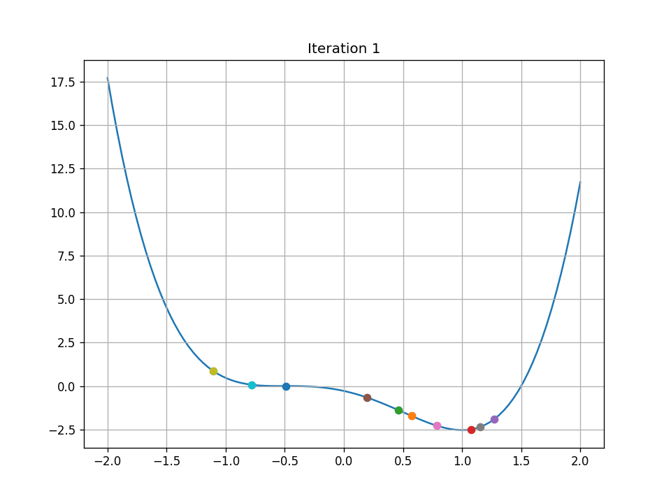

## 1D Particle Swarm Optimization
This project is a learning exercise for particle swarm optimization. 

---
### Usage
Install the requirements.
```
pip install requirements.txt
```

The notebook pso_1d.ipynb uses the simulation class to find minima of a few different functions. It also has a cell that generates a .gif of the algorithm solving a problem.

